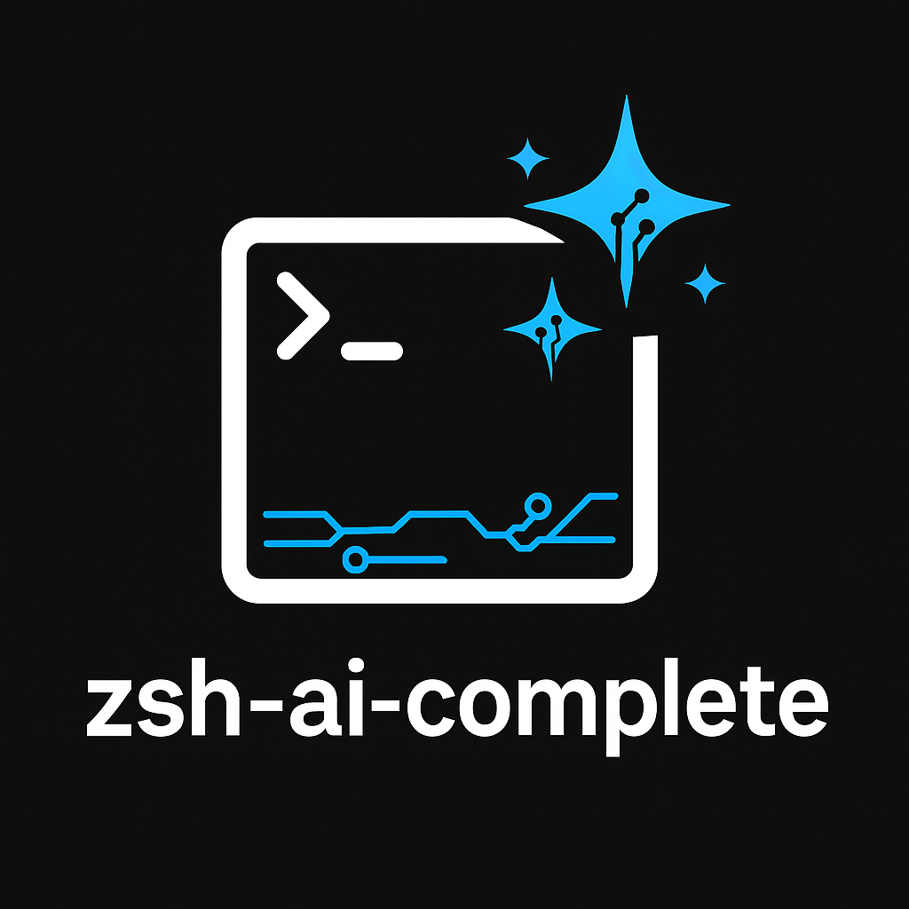

# zsh-ai-complete

<p align="center">
  
</p>

<p align="center">
  <strong>Complete Zsh commands using real-time AI ✨</strong><br>
  Supports OpenAI, Ollama, Gemini, and other configurable models.
</p>

<p align="center">
  
  
</p>

---

## 🔍 About

**zsh-ai-complete** is a Zsh plugin that brings artificial intelligence to your terminal.
It suggests and completes Zsh commands in real time using natural language or partial input.

- 🤖 Works with OpenAI, Ollama, Gemini, and more
- ⚡ Instant AI-powered command suggestions
- 🔄 Switch providers live with `Ctrl+E`
- 🔐 Local config file with API tokens and preferences

---

## ⚙️ Requirements

Make sure the following tools are installed on your system:

| Tool  | Purpose                                 | Link |
|-------|-----------------------------------------|------|
| [`fzf`](https://github.com/junegunn/fzf)   | Interactive search UI               | [Link](https://github.com/junegunn/fzf) |
| [`curl`](https://curl.se/)                | API requests                         | [Link](https://curl.se/) |
| [`jq`](https://stedolan.github.io/jq/)    | JSON parsing                         | [Link](https://stedolan.github.io/jq/) |
| [`bat`](https://github.com/sharkdp/bat)   | Syntax-highlighted command preview   | [Link](https://github.com/sharkdp/bat) |
| [`fd`](https://github.com/sharkdp/fd)     | Optional, for file previews          | [Link](https://github.com/sharkdp/fd) |

---

## 🚀 Installation

### Manual

```bash
git clone https://github.com/lgdevlop/zsh-ai-complete.git ~/.zsh-ai-complete
echo "source ~/.zsh-ai-complete/zsh-ai-complete.plugin.zsh" >> ~/.zshrc
source ~/.zshrc
```

### Zinit

```zsh
zinit light lgdevlop/zsh-ai-complete
```

### Antigen

```zsh
antigen bundle lgdevlop/zsh-ai-complete
```

### Oh My Zsh (manual plugin)

```bash
git clone https://github.com/lgdevlop/zsh-ai-complete.git ${ZSH_CUSTOM:-~/.oh-my-zsh/custom}/plugins/zsh-ai-complete
```

Then add to your `.zshrc`:

```zsh
plugins=(git zsh-ai-complete)
```

Reload with:

```zsh
omz reload   # if using Oh My Zsh
# or
source ~/.zshrc
```

---

## 🛠 Configuration

On first use, the plugin creates:

```bash
~/.config/zsh-ai-complete/ai-providers.json
```

Based on the example:

```bash
example.ai-providers.json
```

Customize it with your tokens and preferences:

```json
{
  "openai": {
    "url": "https://api.openai.com/v1/chat/completions",
    "token": "your_api_key",
    "model": "gpt-4",
    "system_message": "You must output exactly five complete zsh commands. No explanations, no comments, no code blocks, no numbering, no blank lines. Output only the commands, one per line.",
    "output_path": ".choices[0].message.content"
  }
}
```

---

## 💡 Usage

1. Press `Ctrl+U` to launch the assistant (via `fzf`)
2. Type a command fragment _or_ a natural question (multi-language supported)
3. Select one of the AI-suggested commands

> Example: `how do I list docker containers by name?`

See [`project-docs/examples.md`](./project-docs/examples.md) for full walkthroughs.

---

## ⌨️ Shortcuts

| Key       | Action                                |
|-----------|----------------------------------------|
| `Ctrl+U`  | Launch the AI command assistant        |
| `Ctrl+E`  | Switch between configured providers    |
| `ESC`     | Cancel without applying a suggestion   |

More details in [`project-docs/shortcuts.md`](./project-docs/shortcuts.md)

---

## 🛣️ Roadmap

- [x] Support for multiple AI backends
- [x] Dynamic provider switching (Ctrl+E)
- [x] Example and shortcut documentation
- [ ] Output theming and advanced previews
- [ ] Cached suggestions

---

## 🤝 Contributing

Contributions are welcome! Feel free to open issues or pull requests.

See [`CODE_OF_CONDUCT.md`](./CODE_OF_CONDUCT.md).

---

## 📄 License

MIT — See [`LICENSE`](./LICENSE).

---

## 👤 Author

Made with ❤️ by [Leonardo Gomes](https://github.com/lgdevlop)

---

<p align="center">
  <strong>✨ zsh-ai-complete — Make your terminal smarter with the power of AI!</strong>
</p>
